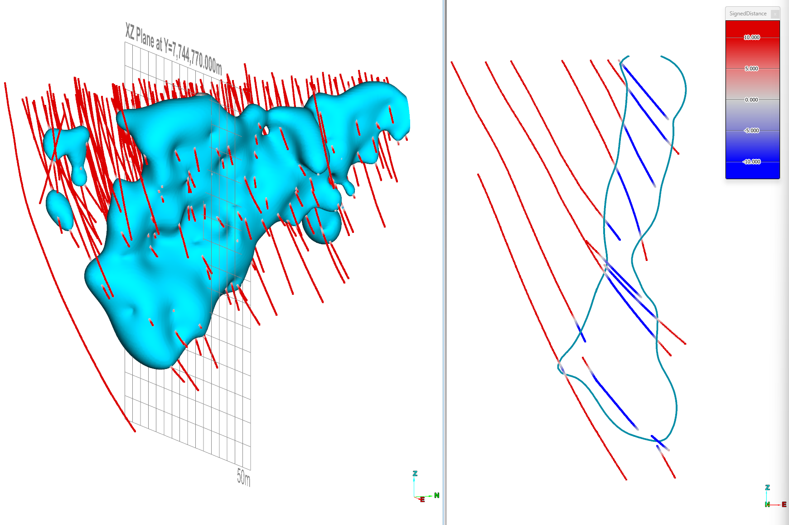
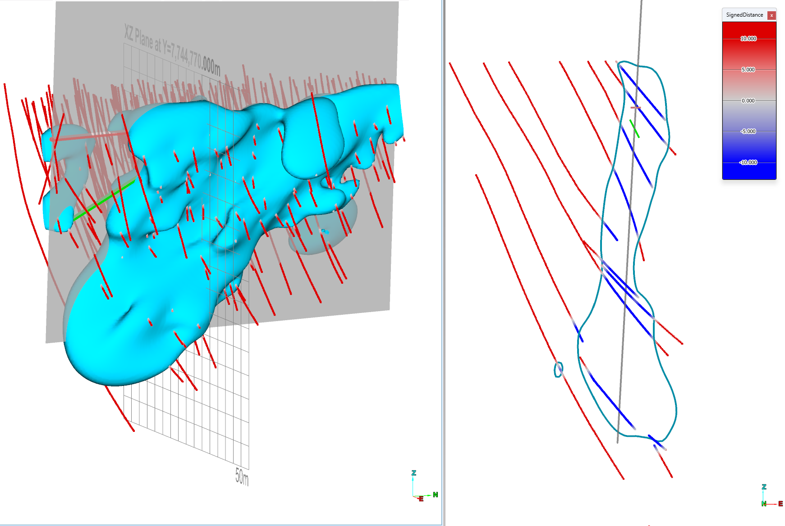
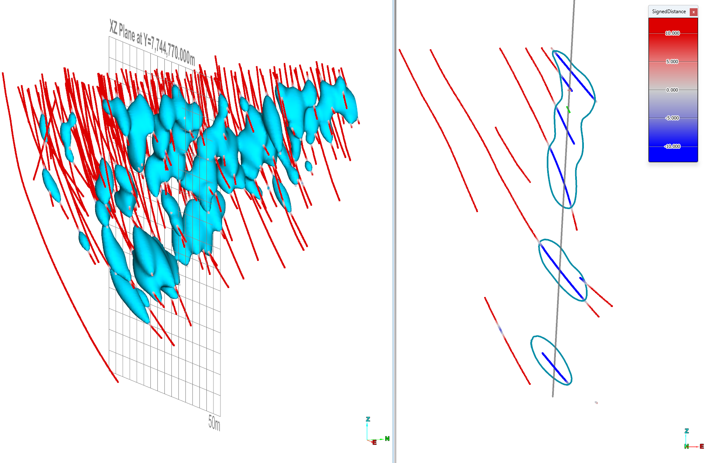

# Examples

Below is a gallery of example workflows. Click any image or title to view the full example.

-   [**Franke's function 2D example**](examples/franke_2d.md)

    

-   [**Isosurface linear interpolant**](examples/isosurface_linear.md)

    

-   [**Isosurface trend linear interpolant**](examples/isosurface_trend_linear.md)

    

-   [**Isosurface spheroidal interpolant**](examples/isosurface_spheroidal.md)

    

-   [**Isosurface spheroidal interpolant constant drift**](examples/isosurface_spheroidal_drift.md)

    

