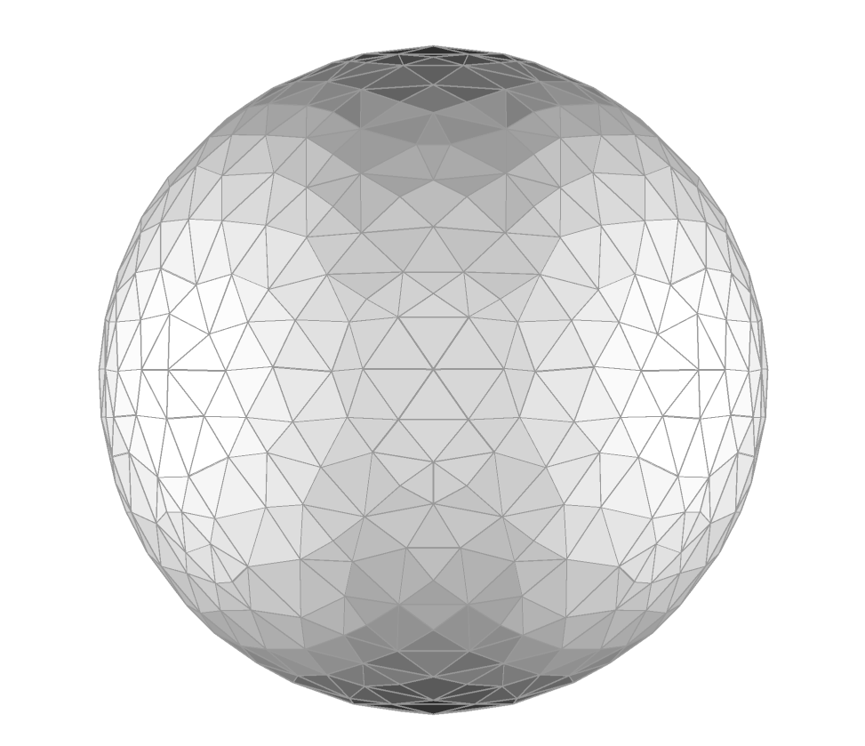

<!-- --8<-- [start:home-before-image] -->
# Fast surface-following isosurface extraction

This library implements a surface-following variant of regularised marching
tetrahedra (RMT) for extracting isosurfaces from implicit scalar fields.

Traditional isosurface extraction methods, such as marching cubes and marching
tetrahedra, usually sample the full volume of interest. That can be expensive
for costly implicit functions, and can produce meshes with large numbers of
poorly shaped triangles.

Regularised marching tetrahedra combines marching tetrahedra with vertex
clustering. The result is an isosurface mesh that remains consistent with the
sampled field while typically using fewer faces and producing better-shaped
triangles than standard marching tetrahedra or marching cubes.

This crate extends RMT with surface-following extraction. Instead of evaluating
the implicit function across the entire volume, extraction starts from one or
more user-provided seed points and expands across the surface. This is
particularly useful for signed-distance fields, radial basis function (RBF)
interpolants, and other implicit functions where evaluations are expensive and
an approximate surface location is already known.

Seed points do not need to lie exactly on the target isosurface. Before
wavefront expansion begins, each seed is projected onto the surface using a
gradient-based search. Users may provide an analytic gradient function, or allow
gradients to be estimated from the scalar field using central differences.

See the examples section for complete usage examples.

---
# Features
- Written in Rust
- Regularised marching tetrahedra with vertex clustering
- Reduced evaluation counts compared with full-volume sampling
- Improved triangle quality compared with standard marching tetrahedra
- Manifold, self-intersection-free mesh generation
- Optional watertight extraction against an axis-aligned bounding box (AABB)

---
## Install

```bash
pip install ferreus_rmt
```

---
## Quick start
```python
import numpy as np
from ferreus_rmt import build_isosurface

# Define the implicit function for a sphere.
def surface_fn(points: np.ndarray) -> np.ndarray:
    radius = 1.0
    return np.linalg.norm(points, axis=1) - radius

# Define the axis-aligned bounding box extents to extract the isosurface within:
# [xmin, ymin, zmin, xmax, ymax, zmax].
extents = np.array([-1.2, -1.2, -1.2, 1.2, 1.2, 1.2], dtype=np.float64)

# Define the resolution of the sample lattice.
resolution = 0.2

# Define the isovalue of the implicit function to surface.
isovalue = 0.0

# Define some seed points on, or near, the isosurface to seed the wavefront.
seed_points = np.array([[1.0, 0.0, 0.0], [-1.0, 0.0, 0.0]], dtype=np.float64)

# Extract the isosurface
mesh = build_isosurface(
    seed_points,
    extents,
    resolution,
    isovalue,
    surface_fn,
)

# Save the isosurface out to an obj file
mesh.save_obj("sphere.obj", "sphere")
```
<!-- --8<-- [end:home-before-image] -->

<!-- --8<-- [start:home-after-image] -->

---
## References
1.  G.M. Treece, R.W. Prager, and A.H. Gee. Regularised marching tetrahedra: improved
    iso-surface extraction. Computers & Graphics, 23(4):583–598, 1999.

---
## Attribution and licensing

This package was developed while the author was working at
[Maptek](https://www.maptek.com) and has been approved for open-source
distribution under the terms of the MIT license.

Unless otherwise stated, the following copyright applies:

> Copyright (c) 2026 Maptek Pty Ltd.  
> All rights reserved.

This copyright applies to all files in this repository, whether or not an
individual file contains an explicit notice.

The code is released under the MIT License - see the top-level `LICENSE` file
for details.
<!-- --8<-- [end:home-after-image] -->
