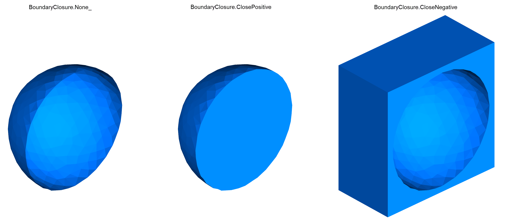

# Examples

Below is a gallery of example workflows. Click any image or title to view the full example.

-   [**Isosurface Sphere**](examples/isosurface_sphere.md)

    

-   [**Boundary closure**](examples/boundary_closure.md)

        

